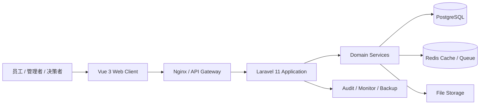

<div align="center">

# Security OA

### 面向安防工程与运维服务企业的一体化业务协同平台

从客户、商机与报价，到项目、施工、采购、库存、售后与财务，<br>
用统一权限、统一审批和统一数据口径连接企业经营全过程。

[](./CHANGELOG.md)
[](./pc-web)
[](./pc-api)
[](https://www.postgresql.org/)
[](./LICENSE)

**[能力地图](#能力地图)** · **[技术架构](#技术架构)** · **[工程导览](#工程导览)** · **[快速开始](#快速开始)** · **[生产部署](#生产部署)**

</div>

---

## 产品定位

Security OA 不是单一的行政办公系统，而是一套围绕安防工程、设备交付和持续运维构建的企业级业务平台。系统以项目为经营主线，以审批为控制节点，以库存和资金为数据闭环，覆盖从售前到交付、再到售后的完整生命周期。

| 核心价值 | 业务结果 |
| --- | --- |
| **经营过程在线化** | 客户、商机、报价、合同、项目与回款信息连续沉淀 |
| **交付过程标准化** | 施工计划、工序、巡检、整改、维修与质保过程可追踪 |
| **物资过程可核算** | 采购、入库、领料、退料、工具与固定资产形成完整流水 |
| **资金过程可复核** | 应收、应付、报销、付款、到账与项目利润口径保持一致 |
| **权限过程可审计** | 角色、数据范围、字段权限、审批记录和操作日志统一治理 |

## 能力地图

| 业务域 | 主要能力 |
| --- | --- |
| **员工工作台** | 个人待办、通知、快捷入口、考勤状态与日程 |
| **经营决策** | 老板看板、经营指标、项目健康度、库存周转与利润分析 |
| **客户与销售** | 客户档案、联系人、跟进日历、商机漏斗、报价与推荐人 |
| **项目与施工** | 项目池、合同、预算、工序、施工日志、巡检与整改 |
| **采购与供应链** | 采购需求、计划、询价、订单、物流、入库与供应商台账 |
| **库存与资产** | 库存、出入库、领退料、调拨、工具使用与固定资产 |
| **售后与质保** | 工单、维修、返修物流、备件、合同服务与质保金 |
| **财务管理** | 账户、收付款、应收应付、报销、开票、内部转账与利润 |
| **行政人事** | 员工、组织、入离职、排班、打卡、请假、加班与车辆 |
| **流程与治理** | 运营/财务/项目审批、可配置流程、权限、审计与备份 |

## 技术架构



| 层级 | 技术选择 | 设计重点 |
| --- | --- | --- |
| **体验层** | Vue 3、TypeScript、Element Plus、Pinia、Vite | 路由级拆包、按需组件、响应式工作台 |
| **应用层** | Laravel 11、Sanctum、Horizon、Spatie Permission | 领域服务、表单校验、审批编排、异步任务 |
| **数据层** | PostgreSQL 15+、Redis | 事务一致性、统计视图、缓存与队列 |
| **交付层** | Nginx、PHP-FPM、Ubuntu LTS | 同源部署、健康探针、日志、备份与缓存预热 |

## 工程导览

| 路径 | 定位 | 说明 |
| --- | --- | --- |
| [`pc-web/`](./pc-web) | Web 客户端 | 页面、组件、状态管理、权限指令和前端 API 适配层 |
| [`pc-api/`](./pc-api) | 业务服务端 | API、领域服务、模型、队列任务、迁移与自动化测试 |
| [`install.sh`](./install.sh) | 生产安装器 | 在 Ubuntu 22.04 / 24.04 LTS 上安装并配置完整运行环境 |
| [`CHANGELOG.md`](./CHANGELOG.md) | 版本记录 | 按版本记录能力变化、重要修复和兼容性说明 |
| [`docs/PROJECT_STRUCTURE.md`](./docs/PROJECT_STRUCTURE.md) | 代码地图 | 关键目录、入口文件、调用关系和常见开发任务导航 |
| [`output/OA_V1.4.2_专项修复验证报告_20260802.md`](./output/OA_V1.4.2_专项修复验证报告_20260802.md) | 验证基线 | V1.4.2 构建、审批、客户、库存和数据一致性验证结果 |

> 仓库仅保留可复用的产品源码、必要配置和正式文档。临时部署包、浏览器缓存、测试附件和本地凭据不属于版本资产。

## 质量与治理

- **权限体系**：角色权限、数据范围、资源归属、字段脱敏与系统专属能力分层控制。
- **业务一致性**：审批结果同步业务单据，库存流水回写结存，资金动作关联来源单据。
- **可观测性**：健康检查、慢请求分级、审计日志、系统监控和后台任务状态。
- **交付安全**：环境变量隔离、随机密钥、生产缓存、登录限流与破坏性操作开关。
- **验证体系**：PHPUnit 功能测试、前端生产构建、页面冒烟与数据库结果交叉核对。

## 快速开始

### 环境要求

| 依赖 | 建议版本 |
| --- | --- |
| Node.js | 20 LTS |
| PHP | 8.5（后端代码最低 8.2） |
| PostgreSQL | 15+ |
| Redis | 6+ |
| Composer | 2.x |

### 启动后端

```bash
cd pc-api
composer install
cp .env.example .env
php artisan key:generate
php artisan migrate
php artisan serve
```

### 启动前端

```bash
cd pc-web
npm ci
npm run dev
```

默认开发模式下，请在前端环境变量中配置 API 地址。生产环境建议由 Nginx 同源托管前端，并将 `/api` 转发到 PHP-FPM。

## 生产部署

仓库提供 Ubuntu 一键安装脚本，可完成 PHP 8.5、Node.js 20、Nginx、PostgreSQL、Redis、Composer、数据库、后端配置和前端构建。

```bash
sudo bash install.sh --domain oa.example.com
```

| 参数 | 作用 |
| --- | --- |
| `--domain <域名或IP>` | 设置访问域名；未提供时自动读取服务器地址 |
| `--dir <路径>` | 设置安装目录，默认 `/var/www/oa` |
| `--demo` | 创建演示管理员并输出随机密码 |
| `--skip-clone` | 使用目标目录中的现有源码 |
| `--force` | 允许覆盖已有安装目录 |

生产启用前应完成 HTTPS、数据库备份计划、邮件服务、队列守护、定时任务和监控告警配置。安装脚本不会硬编码业务账号或固定数据库密码。

## 当前版本

**V1.4.2** 聚焦工具领用/归还明细、前端版本一致性、审批业务状态同步和首屏依赖拆分。完整变更记录见 [`CHANGELOG.md`](./CHANGELOG.md)。

## 许可

本项目基于 [MIT License](./LICENSE) 发布。
